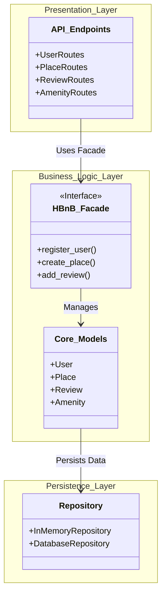
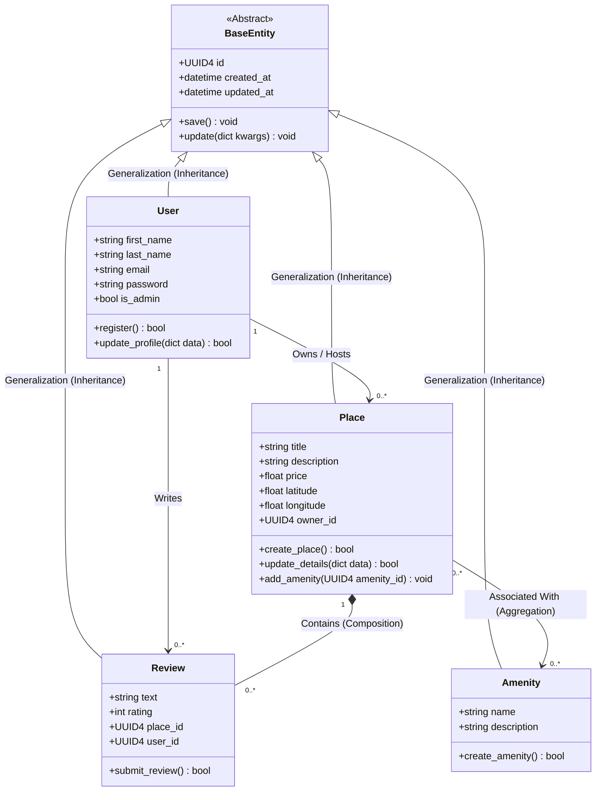
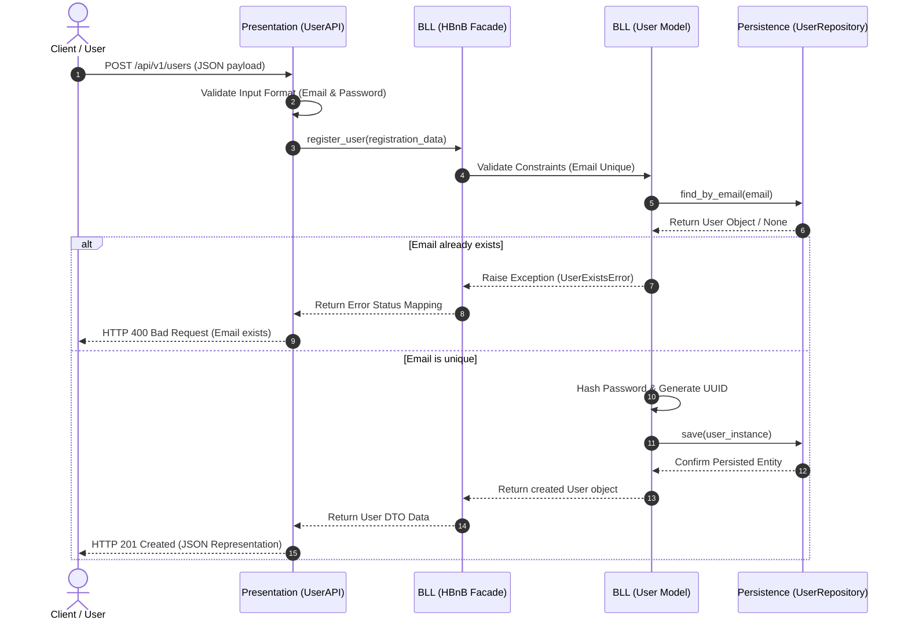
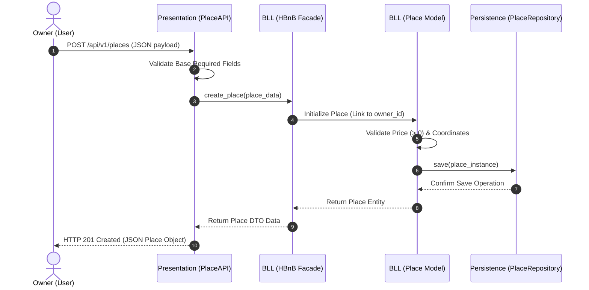
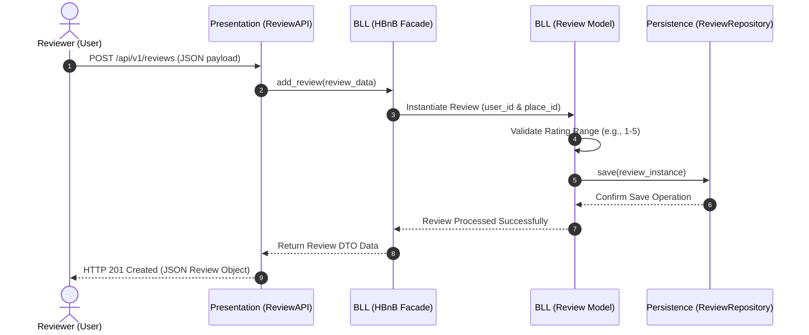
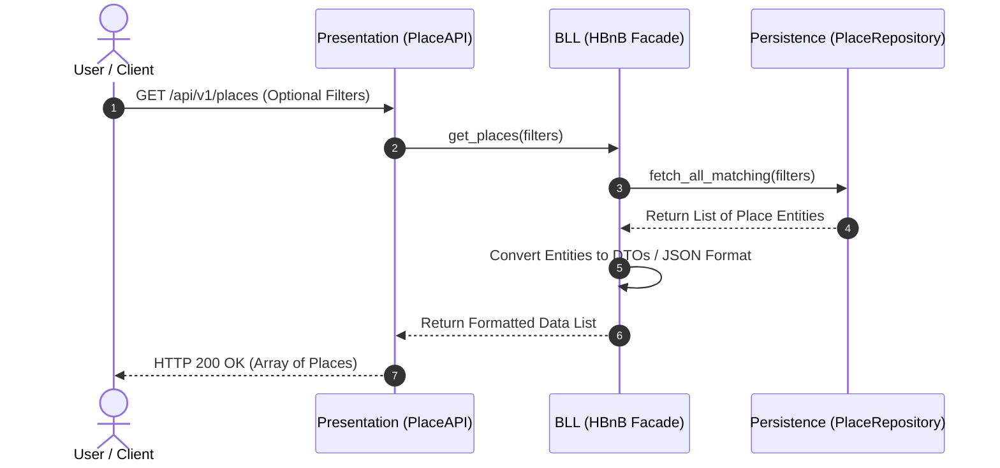

# HBnB Evolution - Part 1: Technical Documentation

This document presents the technical design of the HBnB Evolution application (Part 1). It provides the UML diagrams that describe the system architecture, the main business entities, and the interactions between application layers.

The documentation includes:

- High-Level Package Diagram
- Business Logic Class Diagram
- Sequence Diagrams

---

## Task 0: High-Level Package Diagram

This diagram presents the overall architecture of the application using a three-layer design. It also illustrates how the Presentation Layer communicates with the Business Logic Layer through the Facade pattern, while the Business Logic Layer interacts with the Persistence Layer for data storage.

---

## Task 1: Detailed Class Diagram for Business Logic Layer

The following class diagram represents the main business entities of the system. It includes their attributes, operations, inheritance relationships, and associations that define how the entities interact with one another.

---

## Task 2: Sequence Diagrams for API Calls

The following sequence diagrams describe how requests move through the Presentation, Business Logic, and Persistence layers for common application operations.

### 1. User Registration

This sequence shows the process of creating a new user account, including input validation, uniqueness verification, data persistence, and the response returned to the client.

### 2. Place Creation

This sequence illustrates how a new place is created, validated, stored, and returned to the client after successful processing.

### 3. Review Submission

This sequence demonstrates how a review is validated, saved, and returned after a successful submission.

### 4. Fetching a List of Places

This sequence describes how the application retrieves a filtered list of places and returns the formatted results to the client.

