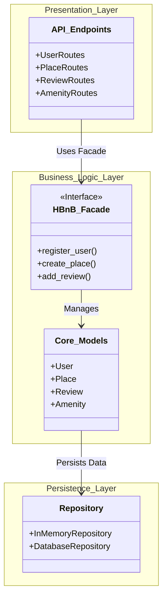
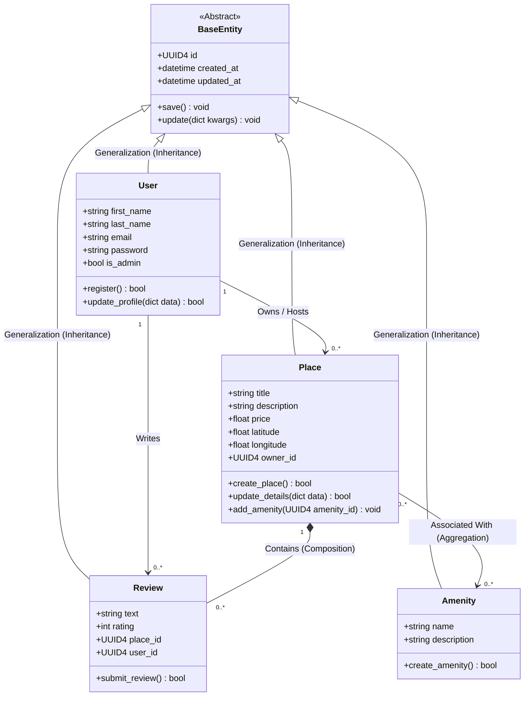

HBnB Evolution - Part 1: Technical Documentation

Task 0: High-Level Package Diagram

📊 Interactive High-Level Package Diagram


----
# 1. Detailed Class Diagram for Business Logic Layer

---
# HBnB Evolution: Technical Documentation - Task 2 (Sequence Diagrams)
#2. Sequence Diagrams for API Calls
## 1. User Registration
This diagram captures the workflow when a user signs up for a new account.

```mermaid
sequenceDiagram
    autonumber
    actor Client as Client / User
    participant API as Presentation (UserAPI)
    participant Facade as BLL (HBnB Facade)
    participant Service as BLL (UserService)
    participant DB as Persistence (UserRepository)

    Client->>API: POST /api/v1/users (JSON payload)
    activate API
    API->>API: Validate Input (Check email & password format)
    
    API->>Facade: register_user(registration_data)
    activate Facade
    
    Facade->>Service: create_user(registration_data)
    activate Service
    
    Service->>DB: find_by_email(email)
    activate DB
    DB-->>Service: Return User Object / None
    deactivate DB
    
    alt Email already registered
        Service-->>Facade: Raise Exception (UserExistsError)
        Facade-->>API: Return Error Status Mapping
        API-->>Client: HTTP 400 Bad Request (Message: Email exists)
    else Email is unique
        Service->>Service: Hash password & instantiate User
        Service->>DB: save(user_instance)
        activate DB
        DB-->>Service: Confirm Persisted Entity
        deactivate DB
        
        Service-->>Facade: Return created User object
        deactivate Service
        
        Facade-->>API: Return User DTO Data
        deactivate Facade
        
        API-->>Client: HTTP 201 Created (JSON User Representation)
    end
    deactivate API
#1. User Registration 

sequenceDiagram
    autonumber
    actor Client as Client / User
    participant API as Presentation (UserAPI)
    participant Facade as BLL (HBnB Facade)
    participant Model as BLL (User Model)
    participant DB as Persistence (UserRepository)

    Client->>API: POST /api/v1/users (JSON payload)
    API->>API: Validate Input Format (Email & Password)
    API->>Facade: register_user(registration_data)
    Facade->>Model: Validate Constraints (Email Unique)
    Model->>DB: find_by_email(email)
    DB-->>Model: Return User Object / None
    
    alt Email already exists
        Model-->>Facade: Raise Exception (UserExistsError)
        Facade-->>API: Return Error Status Mapping
        API-->>Client: HTTP 400 Bad Request (Email exists)
    else Email is unique
        Model->>Model: Hash Password & Generate UUID
        Model->>DB: save(user_instance)
        DB-->>Model: Confirm Persisted Entity
        Model-->>Facade: Return created User object
        Facade-->>API: Return User DTO Data
        API-->>Client: HTTP 201 Created (JSON Representation)
    end
#2. Place Creation
sequenceDiagram
    autonumber
    actor Client as Owner (User)
    participant API as Presentation (PlaceAPI)
    participant Facade as BLL (HBnB Facade)
    participant Model as BLL (Place Model)
    participant DB as Persistence (PlaceRepository)

    Client->>API: POST /api/v1/places (JSON payload)
    API->>API: Validate Base Required Fields
    API->>Facade: create_place(place_data)
    Facade->>Model: Initialize Place (Link to owner_id)
    Model->>Model: Validate Price (> 0) & Coordinates
    Model->>DB: save(place_instance)
    DB-->>Model: Confirm Save Operation
    Model-->>Facade: Return Place Entity
    Facade-->>API: Return Place DTO Data
    API-->>Client: HTTP 201 Created (JSON Place Object)
  

```
